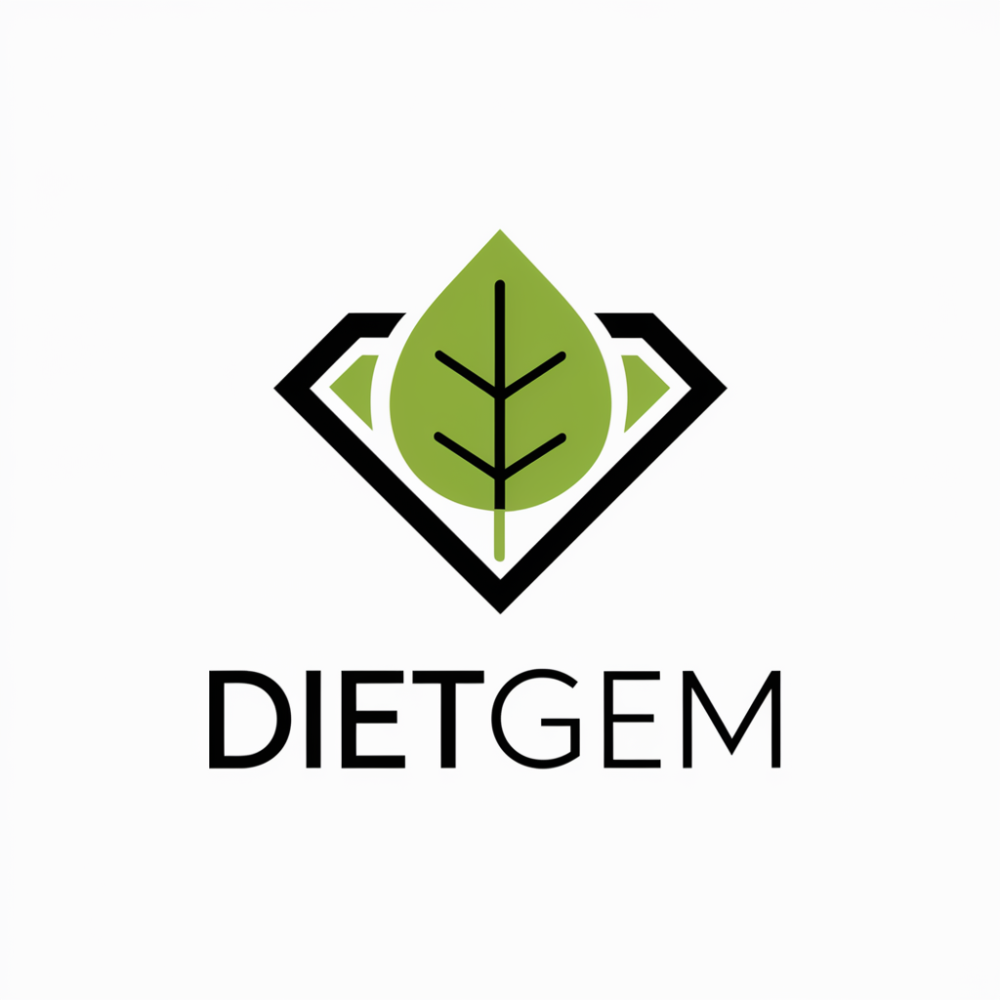

# DietGem: Seu guia inteligente para uma alimentação saudável com IA 🧠

    

DietGem é uma chatbot que utiliza o poder da inteligência artificial para auxiliar você na sua jornada de dieta e reeducação alimentar.

Com uma interface de chat intuitiva, recursos avançados de processamento de linguagem natural e visão computacional, o DietGem oferece uma experiência personalizada para alcançar seus objetivos de saúde.

**Acesse o DietGem: https://diet-gem.vercel.app/**

## 🍽️ Funcionalidades

- [x] **Conversa com o DietGem**: Interaja com o DietGem através de um chat intuitivo, recebendo mensagens personalizadas e orientações.
- [ ] **Definição de perfil e objetivos**: Compartilhe seus dados, preferências alimentares e objetivos de dieta com o DietGem.
- [ ] **Plano alimentar personalizado**: Receba um plano alimentar adaptado às suas necessidades, com metas para calorias e macronutrientes.
- [ ] **Análise de refeições**: Descreva suas refeições ou envie fotos para que o DietGem analise o conteúdo nutricional e forneça feedback.
- [ ] **Sugestões inteligentes**: Obtenha sugestões personalizadas de refeições para atingir seus objetivos e manter uma dieta equilibrada.

## ⚙️ Tecnologia

- **Google Gemin**i: A vanguarda da IA generativa para processamento de linguagem natural e análise de imagens.

- **Next.js**: Framework React para desenvolvimento web rápido e eficiente.

## 🚀 Contribua:

O DietGem é um projeto open-source licenciado sob a GPLv3. Se você é um desenvolvedor, nutricionista ou entusiasta de tecnologia, contribua com ideias, código e sugestões para tornar o DietGem ainda melhor!

Junte-se ao DietGem e comece sua jornada para uma vida mais saudável!
